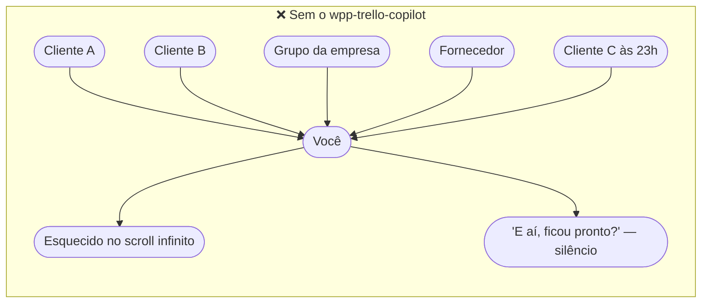
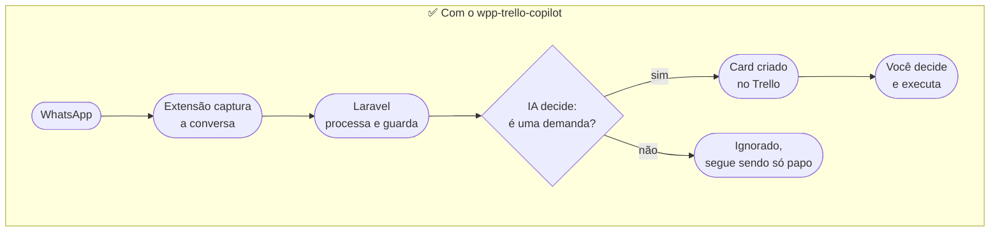
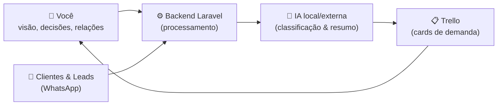
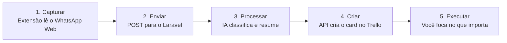

# wpp-trello-copilot

🚀 Transforme conversas do WhatsApp Web em cards de demanda no Trello, usando IA local (Ollama/Llama) & Laravel 13. Privacy-first & 100% open-source.

> A ideia por trás do projeto: você não precisa de um time grande pra ter um negócio grande. Você precisa de um sistema claro e do copiloto de IA certo. O WhatsApp captura, o Laravel processa, a IA classifica e resume, o Trello organiza — você foca só em decidir e executar.

---

## Você tem esse problema?

Se você é dev freelancer, dono de uma software house pequena, ou faz suporte/consultoria e atende clientes pelo WhatsApp, provavelmente já viveu isso:

- Um cliente manda uma demanda no meio de uma conversa qualquer, e ela some no scroll no dia seguinte.
- Você tem 15+ conversas abertas e nenhum lugar único que diga "isso aqui é uma tarefa pendente".
- Alguém pergunta "e aí, ficou pronto?" e você nem lembra que tinha pedido isso.
- Prioridade vira "quem mandou mensagem por último", não o que é mais importante.
- Copiar manualmente cada pedido do WhatsApp pro Trello toma tempo e você simplesmente para de fazer.

O problema não é falta de disciplina — é que **WhatsApp é feito pra conversar, não pra gerenciar trabalho**. E ferramenta de gestão (Trello) só funciona se alguém alimenta ela, sempre, sem falhar.





O `wpp-trello-copilot` é o "alguém" que alimenta o Trello por você: lê o WhatsApp, decide o que é trabalho de verdade, resume e cria o card — sem você precisar copiar e colar nada, e sem seus dados saindo da sua máquina (a IA roda local, via Ollama).

---

## 100% grátis, sem pegadinha

- ✅ **Grátis pra sempre** — sem plano pago, sem trial que vira cobrança, sem "grátis até X quadros/mensagens".
- ✅ **Sem cobrança recorrente** — roda na sua própria máquina; não existe servidor nosso no meio, não existe assinatura.
- ✅ **Código aberto e limpo** — PHP 8.4+ tipado, Laravel 13, JS simples e comentado só onde precisa; dá pra ler, auditar e modificar tudo.
- ✅ **100% funcional** — testado de ponta a ponta: WhatsApp → extensão → Laravel → IA → Trello, e o caminho de volta (Trello → WhatsApp).
- ✅ **Entrega o que promete** — sem funcionalidade "em breve" vendida como se já existisse.

---

## Como funciona (visão geral)



## Ciclo operacional do dia a dia



## Estrutura do repositório

- `/core` — backend Laravel 13 (SQLite, Livewire, Tailwind) que recebe as mensagens, roda a IA e conversa com o Trello.
- `/extension` — extensão de Chrome (Manifest V3) que injeta um botão flutuante no WhatsApp Web para sincronizar conversas e enviar respostas.

---

## Rodando via Docker (opcional)

Se preferir não instalar PHP/Composer/Node na sua máquina, o backend também está publicado como imagem Docker (aba **Packages** deste repositório, `ghcr.io/vagnergiraldinojr/wpp-trello-copilot`):

```sh
docker compose up
```

Isso sobe o backend em `http://localhost:8000`, já com SQLite e migrations rodando automaticamente na inicialização (veja `docker-compose.yml` e `core/Dockerfile`). Pra buildar localmente em vez de puxar a imagem publicada, descomente a linha `build: ./core` no `docker-compose.yml`.

> A extensão de Chrome continua sendo instalada normalmente (ela roda no navegador, não dentro do container) — veja o passo 4 abaixo.

---

## Passo a passo completo (pt-BR)

Este guia assume que você nunca mexeu no projeto. Siga na ordem — cada passo depende do anterior.

### 0. Pré-requisitos

| Ferramenta | Pra que serve | Como instalar |
|---|---|---|
| PHP 8.4+ e Composer | Rodar o backend Laravel | [php.new](https://php.new) |
| Node.js e npm | Compilar o CSS/JS do painel | [nodejs.org](https://nodejs.org) |
| Google Chrome | Rodar a extensão e o WhatsApp Web | — |
| [Ollama](https://ollama.com) (opcional, mas recomendado) | IA local, sem custo e sem enviar dados pra fora | `ollama pull llama3.1` |

### 1. Subir o backend

```sh
./start.sh      # macOS/Linux
start.bat       # Windows
```

Na primeira execução o script instala as dependências (Composer/NPM), cria o `.env`, o banco SQLite e roda as migrations. Em seguida sobe `php artisan dev`, que inicia junto: servidor HTTP, worker de filas, Vite e logs.

Depois de rodar, acesse **http://localhost:8000/setup** — se aparecer a tela com as abas "Trello", "Motor de IA", "Templates" e "Logs", deu certo.

### 2. Configurar o Trello

1. Acesse **https://trello.com/power-ups/admin** e clique em **"Novo"** pra criar uma integração (nome livre, ex: `wpp-trello-copilot`, workspace onde está seu quadro).
2. Na aba **"Chave de API"** da integração, copie a **Chave de API**.
3. Do lado da chave, tem um link **"token"** — clique, autorize, e copie o **Token** gerado.
4. No board que você quer usar (crie um se não tiver), crie pelo menos duas listas: uma pra receber demandas novas (ex: **"Entrada"**) e outra pra marcar como concluído (ex: **"Resolvido"**).
5. No painel `/setup`, aba **Trello**: cole Chave de API e Token, clique em **Conectar**, escolha o quadro, e depois as colunas de Entrada e Resolvido. Clique em **"Salvar colunas e registrar webhook"**.

> ⚠️ O registro automático do webhook só funciona se o Laravel estiver acessível pela internet (não é o caso de `localhost` numa máquina local). Isso é normal e não trava nada — a criação de cards funciona sem o webhook; só a notificação automática de volta pro WhatsApp quando você resolve um card depende dele. Se quiser essa parte, exponha o `localhost:8000` com uma tunnel (ex: `cloudflared tunnel --url http://localhost:8000`) e refaça esse passo com a URL pública.

### 3. Configurar o motor de IA

Na aba **Motor de IA** do `/setup`:

- **Ollama Local** (recomendado): URL `http://localhost:11434`, e o nome do modelo **exatamente** como aparece em `ollama list` (ex: `llama3.1:8b`, não `llama3.1`). Nome errado = a IA falha silenciosamente e nenhuma demanda é criada.
- **API Externa**: escolha OpenAI ou Claude e cole sua API Key.

Clique em **Salvar**.

> 💡 Se seu computador tiver pouca memória livre, prefira um modelo leve (ex: `lfm2.5:8b`) — modelos grandes podem travar/demorar demais pra responder na primeira chamada.

### 4. Instalar a extensão no Chrome

1. Abra `chrome://extensions`.
2. Ative o **"Modo do desenvolvedor"** (canto superior direito).
3. Clique em **"Carregar sem compactação"** e selecione a pasta `/extension`.
4. Feche **todas** as abas do WhatsApp Web que já estiverem abertas.
5. Abra uma aba **nova** em `https://web.whatsapp.com` — o botão flutuante verde **"▶ Iniciar Sincronização"** deve aparecer no canto inferior direito.

> ⚠️ **Regra de ouro:** sempre que você recarregar a extensão em `chrome://extensions`, feche e reabra a aba do WhatsApp Web **depois**. Se pular isso, o Console mostra `Uncaught Error: Extension context invalidated` e nada sincroniza — não é bug, é o navegador descartando o script antigo que ficou "órfão" na aba já aberta.

### 5. Sincronizar

1. Clique em **"▶ Iniciar Sincronização"** e deixe rodar até o fim (leva alguns segundos por conversa).
2. Quando terminar, clique em **"⏹ Parar"** — importante fazer isso antes de fechar ou recarregar qualquer coisa, senão a sincronização retoma sozinha na próxima vez que a página abrir.
3. Volte no `/setup`, aba **Logs**, e veja as demandas detectadas pela IA. Cada uma vira um card no Trello, com o nome do contato no título.

---

## Problemas comuns

| Sintoma | Causa | Solução |
|---|---|---|
| `Extension context invalidated` no Console | Extensão recarregada com a aba do WhatsApp já aberta | Feche a aba, recarregue a extensão, abra uma aba nova |
| Nenhuma conversa sincroniza, mas não dá erro | WhatsApp mudou o HTML da lista de conversas | Veja `CONVERSATION_ITEM_SELECTORS` em `extension/content.js` — pode precisar de um seletor novo |
| Log mostra `Ollama request failed {"status":404}` | Nome do modelo não bate com o instalado | Rode `ollama list` e copie o nome exato (com a tag, ex: `:8b`) pra aba Motor de IA |
| Ollama trava/demora muito (timeout de 60s) | Modelo grande demais pra memória disponível | Troque por um modelo mais leve, ou rode `ollama run <modelo>` uma vez direto no terminal pra pré-carregar |
| Webhook do Trello dá erro "URL not reachable" | `localhost` não é acessível pela internet | Normal em ambiente local; a criação de cards continua funcionando sem o webhook |
| Mesma demanda aparece em vários contatos errados | A lista de conversas do WhatsApp é virtualizada; um clique pode "grudar" na conversa anterior | Já corrigido em `content.js` (confirma a troca do cabeçalho antes de extrair mensagens) — se acontecer de novo, garanta que só uma sincronização está rodando por vez |

---

## Licença

Veja [LICENSE](LICENSE).
